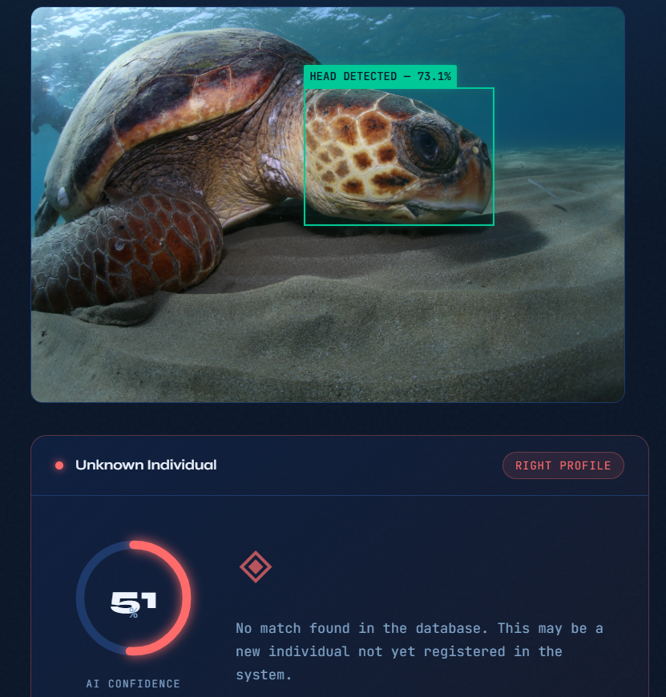
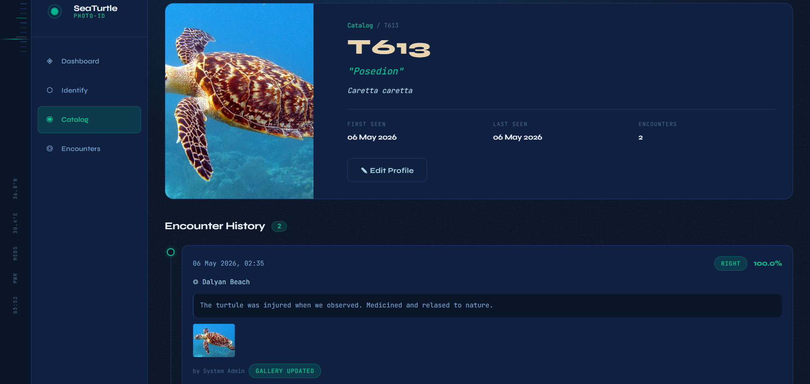
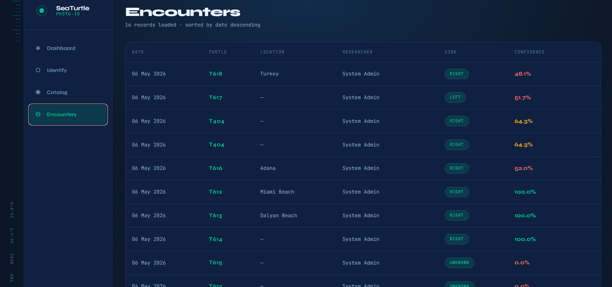
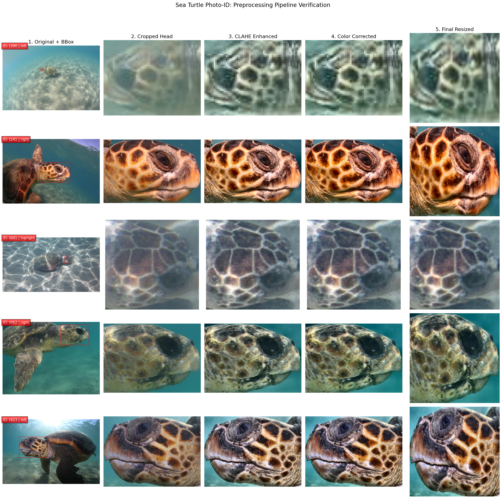

<p align="center">
  
</p>

<h1 align="center">🐢 SeaTurtle Photo-ID</h1>

<p align="center">
  <strong>Non-invasive biometric identification for sea turtles using deep learning</strong>
</p>

<p align="center">
  
  
  
  
  
  
  
  
</p>

<p align="center">
  Upload a raw, uncropped sea turtle photo → get an identity match in seconds.<br/>
  Zero manual input. Zero retraining for new individuals. Fully containerized.
</p>

---

## ✨ Features

- **Autonomous Identification** — Upload any field photo; the system detects, crops, embeds, and matches automatically
- **YOLOv8-Nano Head Detection** — Locates turtle heads with 94–98% detection rate in a single forward pass
- **ArcFace Metric Learning** — ResNet-50 backbone producing 512-d embeddings with +253% accuracy over baseline
- **FAISS Vector Search** — 8,526 embeddings across 3 biologically separated indexes (left / right / top)
- **Fallback Search** — Searches all indexes unconditionally, eliminating orientation misclassification risk
- **2-Phase Registration** — Unknown turtles receive a session → researcher confirms → new ID created instantly
- **One-Command Deployment** — Full stack via `docker compose up --build`
- **Bioluminescent Web UI** — Deep ocean themed React frontend for field researchers

---

## 🖼️ Screenshots

<table>
  <tr>
    <td align="center"><strong>Turtle Identification</strong></td>
    <td align="center"><strong>Turtle Profile</strong></td>
    <td align="center"><strong>Encounter History</strong></td>
  </tr>
  <tr>
    <td></td>
    <td></td>
    <td></td>
  </tr>
</table>

---

## 🏗️ Architecture

```
📷 Raw Photo
     │
     ▼
┌─────────────────────┐
│  YOLOv8-Nano        │  Head detection + orientation classification
│  (3 classes)        │  head_left · head_right · head_top
└────────┬────────────┘
         │ bbox crop
         ▼
┌─────────────────────┐
│  Preprocessing      │  CLAHE → Color correction → Resize 224×224
└────────┬────────────┘
         │
         ▼
┌─────────────────────┐
│  ResNet-50 + ArcFace│  Image → 512-d embedding (L2-normalized)
└────────┬────────────┘
         │
         ▼
┌─────────────────────┐
│  FAISS Fallback     │  Search LEFT + RIGHT + TOP indexes
│  Search             │  Return best match across all three
└────────┬────────────┘
         │
         ▼
   ┌───────────┐
   │  Result   │  score ≥ 0.6 → "Known: t042"
   │           │  score < 0.6 → "Unknown"
   └───────────┘
```

### Docker Services

```
┌────────────────────────────────────────────────────────────┐
│                    Docker Network                          │
│                                                            │
│  ┌──────────────┐  ┌──────────────┐  ┌───────────────┐   │
│  │ seaturtle-db │  │ seaturtle-ai │  │ seaturtle-api │   │
│  │ PostgreSQL 16│  │ FastAPI      │  │ .NET 10       │   │
│  │ :5432        │  │ :8000        │  │ :5000         │   │
│  └──────────────┘  └──────────────┘  └───────────────┘   │
│                                                            │
│  ┌─────────────────────────────────────────────────────┐  │
│  │              seaturtle-frontend                      │  │
│  │              React + Nginx · :3000                   │  │
│  └─────────────────────────────────────────────────────┘  │
└────────────────────────────────────────────────────────────┘
```

---

## 🚀 Quick Start

### Prerequisites

- [Docker](https://docs.docker.com/get-docker/) & Docker Compose
- ~4 GB free disk space (AI models + dataset)

### Run

```bash
# Clone the repository
git clone https://github.com/aeren23/sea-turtle-project.git
cd sea-turtle-project

# Start all services
docker compose up --build
```

### Access

| Service | URL | Description |
|---|---|---|
| 🌐 **Frontend** | [http://localhost:3000](http://localhost:3000) | Web application |
| 📡 **API (Swagger)** | [http://localhost:5000/swagger](http://localhost:5000/swagger) | .NET API documentation |
| 🤖 **AI Service** | [http://localhost:8000/docs](http://localhost:8000/docs) | FastAPI interactive docs |
| 🗄️ **Database** | `localhost:5432` | PostgreSQL (user: `turtle_admin`) |

### Default Credentials

```
Username: admin@seaturtle.com
Password: Admin123!
```

---

## 🔌 API Reference

### .NET 10 Web API (`/api`)

| Endpoint | Method | Auth | Description |
|---|---|---|---|
| `/api/Auth/register` | POST | — | Create a researcher account |
| `/api/Auth/login` | POST | — | Get JWT token |
| `/api/Turtles` | GET | 🔒 | List all known turtles |
| `/api/Turtles/{id}` | GET | 🔒 | Turtle detail with photos |
| `/api/Identification/identify` | POST | 🔒 | Upload photo → AI identification |
| `/api/Encounters` | GET | 🔒 | List encounter history |
| `/api/Encounters/{id}` | GET | 🔒 | Encounter details |

### FastAPI AI Service (`/api/v1`)

| Endpoint | Method | Description |
|---|---|---|
| `/api/v1/identify` | POST | Raw photo → YOLO + ArcFace + FAISS → identity |
| `/api/v1/register` | POST | Confirm unknown → assign new turtle ID |
| `/health` | GET | Pipeline status check |

---

## 🧠 AI Pipeline

The AI system uses a multi-stage pipeline trained on the **DEKAMER** sea turtle dataset.

### Preprocessing



*5-stage transformation: ROI Extraction → Crop → CLAHE → Color Correction → Resize 224×224*

### Key Metrics

| Component | Metric | Value |
|---|---|---|
| **ArcFace Model** | Top-1 Accuracy | **49.69%** (1000-class open-set) |
| **ArcFace Model** | Top-5 Accuracy | **52.32%** |
| **ArcFace Model** | Improvement over Baseline | **+253%** |
| **YOLO Detector** | Head Detection Rate | **94–98%** |
| **YOLO Detector** | mAP50 | **0.761** |
| **FAISS Gallery** | Total Embeddings | **8,526** |
| **FAISS Gallery** | Biological Indexes | 3 (left, right, top) |
| **End-to-End** | Query Latency | ~155ms (YOLO + ResNet + FAISS) |

### Why Three Indexes?

Sea turtle post-ocular scale patterns are **biologically asymmetric** — the left and right facial profiles of the same individual are completely different, like separate fingerprints. Mixing them in a single vector database would create cross-side noise. The system maintains `faiss_left.bin`, `faiss_right.bin`, and `faiss_top.bin` as independent identity spaces.

---

## 📁 Project Structure

```
sea-turtle-project/
├── ai-core/                    # 🧠 AI Training & Models
│   ├── src/
│   │   ├── config/             # Data paths, hyperparameters
│   │   ├── data/               # Dataset parser, augmentations
│   │   ├── identification/     # FAISS vector store, embedding extractor
│   │   ├── inference/          # YOLO head detector, inference pipeline
│   │   └── training/           # ArcFace model, training loop
│   ├── scripts/                # Training & evaluation scripts
│   ├── gallery_index/          # FAISS indexes + metadata
│   └── tests/                  # Unit tests (36 tests)
│
├── ai-service/                 # 🤖 FastAPI Microservice
│   ├── main.py                 # API endpoints
│   ├── schemas.py              # Pydantic models
│   ├── session_store.py        # Registration session management
│   └── Dockerfile
│
├── backend/                    # 📡 .NET 10 Web API
│   └── SeaTurtle.API/
│       ├── Controllers/        # Auth, Turtles, Identification, Encounters
│       ├── Models/             # EF Core entities
│       ├── Services/           # AI client, auth, DB seeder
│       └── Dockerfile
│
├── frontend/                   # 🌐 React + Vite + TypeScript
│   ├── src/
│   │   ├── pages/              # 6 pages (Login, Dashboard, Identify, etc.)
│   │   ├── components/         # Reusable UI components
│   │   ├── services/           # Axios API clients
│   │   └── stores/             # Zustand state management
│   └── Dockerfile
│
├── agents/                     # 🔬 CrewAI Research System
│   ├── agents.py               # 5 specialist AI agents
│   ├── tasks.py                # Research task definitions
│   └── run_research_crew.py    # Orchestrator runner
│
├── docs/                       # 📄 Documentation
│   ├── reports/                # Phase reports + visual assets
│   ├── research_outputs/       # CrewAI agent debate logs
│   └── specifications/         # Architecture specs, state tracking
│
├── docker-compose.yml          # 🐳 Full stack orchestration
└── ProjectReport.md            # 📋 Comprehensive engineering chronicle
```

---

## 🛠️ Tech Stack

| Layer | Technology |
|---|---|
| **AI / ML** | PyTorch 2.x · ResNet-50 · ArcFace Loss · YOLOv8-Nano · FAISS · Albumentations · OpenCV |
| **Backend** | .NET 10 · ASP.NET Core · Entity Framework Core · PostgreSQL 16 · JWT Auth |
| **Frontend** | React 18 · TypeScript · Vite · Zustand · Axios · React Router v6 · Zod |
| **Infrastructure** | Docker Compose · Nginx · Uvicorn · Swagger/OpenAPI |
| **Research** | CrewAI · GPT-4o-mini · Multi-agent hierarchical process |

---

## 📄 Documentation

| Document | Description |
|---|---|
| [ProjectReport.md](ProjectReport.md) | Full engineering chronicle (Phase 1 → 4.0) with ADRs and agent debates |
| [Phase 2 Training Summary](docs/reports/phase2_training_summary.md) | ResNet-50 ArcFace training metrics |
| [Phase 2.5 Embedding Gallery](docs/reports/phase2_5_embedding_gallery.md) | FAISS vector store build report |
| [Phase 2.6 YOLO Detection](docs/reports/phase2_6_yolo_head_detection.md) | YOLOv8 training report with confusion matrix analysis |
| [Fallback Strategy](docs/reports/mvp_fallback_strategy.md) | Multi-index search decision record |
| [Fallback Demo](docs/reports/fallback_demo_report.md) | Visual proof of fallback mechanism |

---

## 🤝 Contributing

Contributions are welcome! Please follow these steps:

1. **Fork** the repository
2. **Create** a feature branch (`git checkout -b feature/amazing-feature`)
3. **Follow** the coding standards in [`docs/rules/coding_standards.md`](docs/rules/coding_standards.md)
4. **Follow** the git standards in [`docs/rules/git_standards.md`](docs/rules/git_standards.md)
5. **Commit** using [Conventional Commits](https://www.conventionalcommits.org/) (`feat:`, `fix:`, `docs:`, etc.)
6. **Push** and open a Pull Request

> **Important:** Horizontal image flipping is **strictly banned** in all data augmentation pipelines due to biological asymmetry of sea turtle scale patterns.

---

## 📜 License

This project is licensed under **Academic Use Only**.

This software and associated documentation are provided for academic and research purposes only. Commercial use, redistribution for profit, or incorporation into commercial products is strictly prohibited without prior written permission from the authors.

---

## 🙏 Acknowledgments

- **[DEKAMER](https://dekamer.org.tr/)** — Sea Turtle Research, Rescue & Rehabilitation Center for the dataset and domain expertise
- **Pamukkale University** — Institutional support and academic supervision
- **CrewAI** — Multi-agent research framework enabling AI-assisted architectural decisions

---

<p align="center">
  Built with 💙 for sea turtle conservation<br/>
  <em>Every turtle has a unique face. This system remembers them all.</em>
</p>
