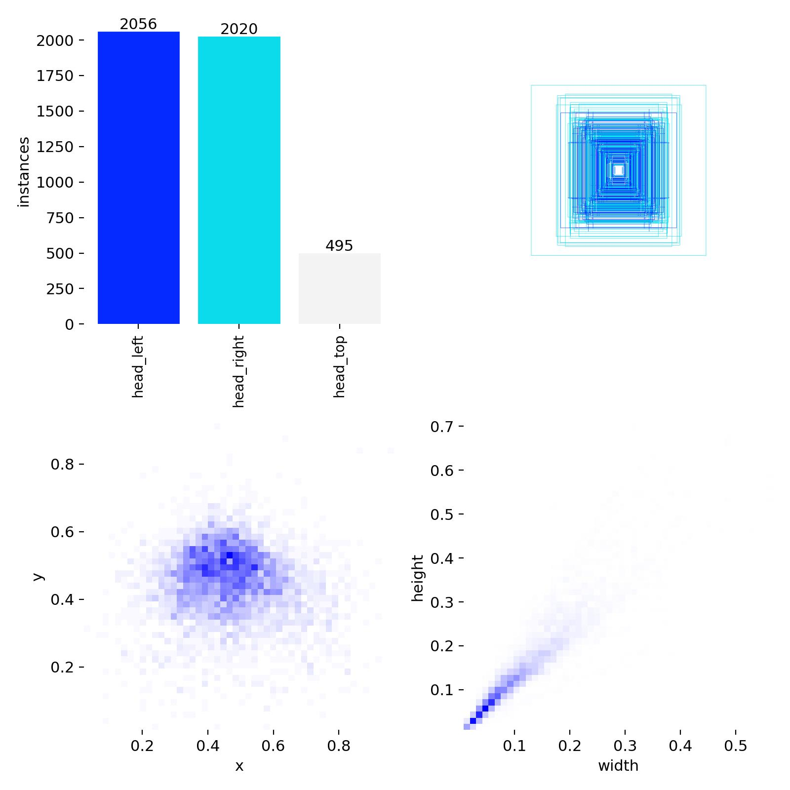
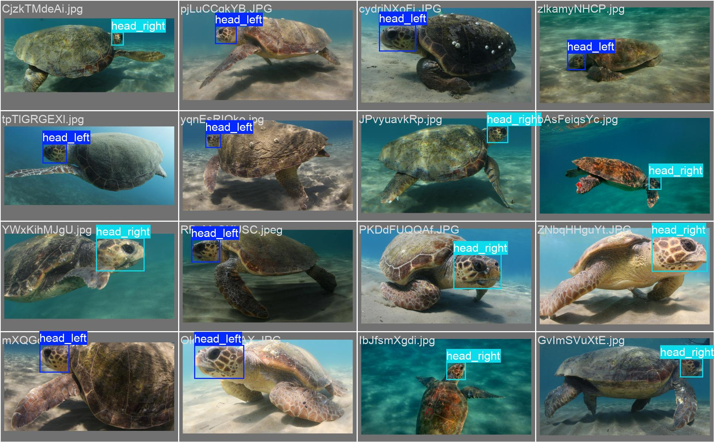
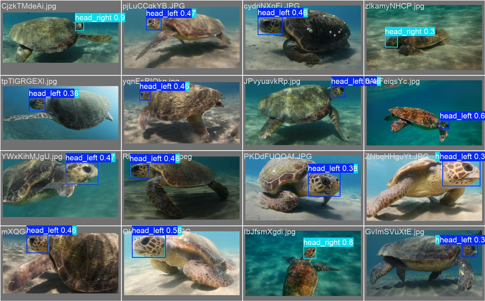
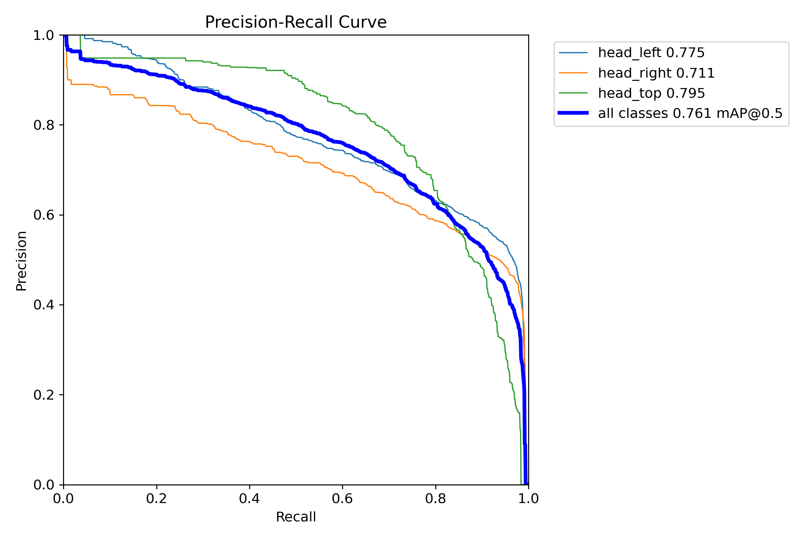
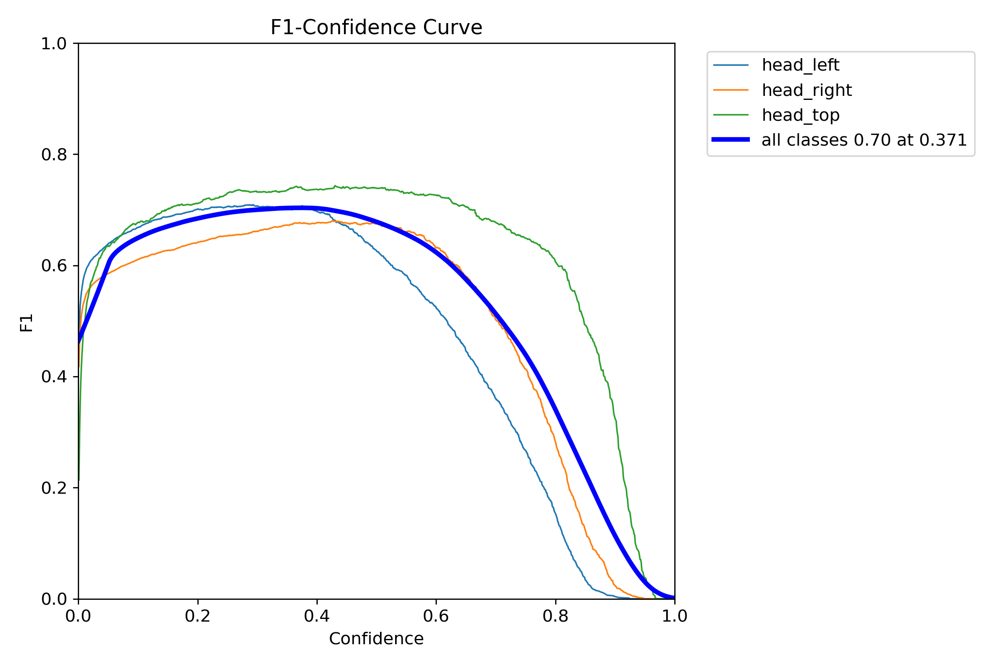

# Phase 2.6 Report: YOLO Head Detection & Orientation Classification

**Date:** 2026-05-05
**Author:** Cascade / AI Coding Assistant
**Model:** YOLOv8-Nano (ultralytics)
**Training Duration:** ~70 min (40 epochs, early stop at patience=10)

---

## Summary

Trained a YOLOv8-Nano model for simultaneous **head detection** and **orientation classification** (3 classes) on the SeaTurtle dataset. The model replaces the manual `--side` and `--bbox` parameters required by Phase 2.5, enabling a fully autonomous inference pipeline. Head detection performance is strong (mAP50 = 0.761), but left/right orientation classification suffers from annotation inconsistency in the source data.

---

## Motivation

Phase 2.5 (`TurtleIdentifier`) required two manual inputs at query time:
1. `--side left|right|top` — which FAISS index to search
2. `--bbox x,y,w,h` — head bounding box for cropping

These dependencies blocked autonomous production inference. A single YOLO model solves both by detecting the head location (bbox) and classifying its biological side (orientation) in one forward pass.

---

## Dataset Preparation

### Source Data
- **Annotations:** `archiveu/turtles-data/data/annotations.json` (COCO format)
- **Metadata:** `archiveu/turtles-data/data/metadata_splits.csv`
- **Images:** Original images in `archiveu/turtles-data/data/images/` (no copying)

### YOLO Format Conversion
Labels written to `archiveu/turtles-data/data/labels/` (parallel to `images/`).
YOLO auto-resolves label paths by replacing `/images/` → `/labels/` in each image path.

**Script:** `scripts/prepare_yolo_dataset.py`

### 3-Class Mapping (Orientation → YOLO Class)

| YOLO Class ID | Class Name | Source Orientations |
|---|---|---|
| 0 | `head_left` | `left`, `topleft` |
| 1 | `head_right` | `right`, `topright` |
| 2 | `head_top` | `top`, `front`, `back`, others |

This mapping is identical to `SeaTurtleDatasetParser._map_orientation_to_side()` used in the gallery build, ensuring consistency between FAISS indexes and YOLO predictions.

### Dataset Split

| Split | Image Count | Source |
|---|---|---|
| Train | 4,571 | `split_closed = "train"` or `"val"` |
| Val | 3,955 | `split_closed = "test"` |
| **Total** | **8,526** | |

### Class Distribution

| Class | Count | Percentage |
|---|---|---|
| head_left | 3,906 | 45.8% |
| head_right | 3,634 | 42.6% |
| head_top | 986 | 11.6% |



**Observation:** `head_top` is significantly underrepresented (~12%). This class imbalance may affect top-view detection sensitivity but is mitigated by the clear visual distinctiveness of top-view images.

---

## Training Configuration

| Parameter | Value |
|---|---|
| Base Model | `yolov8n.pt` (pretrained on COCO) |
| Epochs | 50 (early stopped at 40) |
| Batch Size | 16 |
| Image Size | 640 × 640 |
| Optimizer | AdamW (auto) |
| Patience | 10 (early stopping) |
| Device | CPU |

**Script:** `scripts/train_yolo_detector.py`

---

## Training Curves


### Loss Curves (Top Row)

| Metric | Start → End | Interpretation |
|---|---|---|
| **train/box_loss** | 1.01 → 0.58 | Bbox regression converged well |
| **train/cls_loss** | 2.49 → 0.70 | Class prediction improved significantly |
| **train/dfl_loss** | 1.03 → 0.88 | Distribution focal loss — moderate improvement |

### Validation Curves (Bottom Row)

| Metric | Start → End | Interpretation |
|---|---|---|
| **val/box_loss** | 0.88 → 0.59 | Good generalization, no severe overfitting |
| **val/cls_loss** | 1.52 → 0.82 | Higher than train (~0.12 gap) — mild overfitting on class prediction |
| **val/dfl_loss** | 1.00 → 0.93 | Stable, minimal overfitting |
| **mAP50** | 0.46 → **0.76** | Strong improvement, peak at epoch 30 |
| **mAP50-95** | 0.35 → **0.60** | Strict metric also improved well |

### Key Observations from Curves
- **Box loss** (localization) converged smoothly — model learned to find heads effectively.
- **Cls loss** shows a train/val gap of ~0.12, indicating mild overfitting on orientation classification. This is expected given annotation noise.
- **Precision** is noisy (0.47–0.66 range), suggesting class confusion.
- **Recall** is consistently high (0.73–0.85), meaning the model rarely misses a head entirely.

---

## Final Model Performance (Best Epoch: 30)

| Metric | Value |
|---|---|
| **mAP50** | **0.761** |
| **mAP50-95** | **0.595** |
| **Precision** | 0.655 |
| **Recall** | 0.783 |
| **Val box_loss** | 0.611 |
| **Val cls_loss** | 0.802 |

---

## Confusion Matrix Analysis


### Per-Class Accuracy

| True Class | Correct | Major Confusion | Miss Rate |
|---|---|---|---|
| **head_left** | **54%** | 42% → predicted as head_right | 2% |
| **head_right** | **64%** | 31% → predicted as head_left | 2% |
| **head_top** | **74%** | 10% left + 10% right | 6% |

### Key Findings

1. **Head Detection is Strong:** Only 2–6% of true heads are missed (predicted as background). The model reliably locates turtle heads.

2. **head_top is Best Classified (74%):** Top-view images are visually distinct from profile views, making them easier to classify.

3. **Left ↔ Right Confusion is Severe:**
   - 42% of true `head_left` samples are predicted as `head_right`
   - 31% of true `head_right` samples are predicted as `head_left`
   - This is NOT a model architecture issue — it stems from annotation inconsistency in the source data (see Root Cause Analysis below).

4. **Background False Positives:**
   - 48% of background regions trigger `head_left` predictions
   - 47% trigger `head_right` predictions
   - These are filtered by confidence threshold in production.

---

## Validation Predictions (Visual)

### Ground Truth Labels


### Model Predictions


### Observations
- Bounding boxes are well-localized — the model correctly identifies head regions.
- Confidence scores are generally moderate (0.3–0.6), with occasional high-confidence detections (0.8–0.9).
- `head_left` is over-predicted relative to `head_right`, likely due to slight class imbalance and annotation noise.

---

## Root Cause Analysis: Left/Right Confusion

### The Annotation Convention Problem

During ground truth inspection of `train_batch0.jpg`, we identified turtles swimming in **opposite directions** but labeled with the **same class**:


The `annotations.json` `orientation` field appears to mix two labeling conventions:
- **Convention A (Biological Side):** "left" = the turtle's left biological side (left post-ocular scales) is visible → turtle appears to face RIGHT in the image.
- **Convention B (Visual Direction):** "left" = the turtle is visually facing/moving LEFT in the image → right biological side is visible.

Some annotators used Convention A, others used Convention B, creating **systematic noise** in the training labels.

### Impact on System Consistency

Despite the annotation issue, the **identification system remains internally consistent** because:

```
Gallery Build:  annotations.json → dataset_parser._map_orientation_to_side() → faiss_left/right/top
YOLO Training:  annotations.json → prepare_yolo_dataset.orientation_to_class_id() → class 0/1/2
Inference:      YOLO class 0 → "left" → search faiss_left
```

All three paths use the **same mapping from the same annotations**. A consistently mislabeled turtle will be:
1. Stored in the "wrong" FAISS index during gallery build
2. Predicted as the same "wrong" class by YOLO
3. Searched in the same "wrong" FAISS index → **match found correctly**

The risk is for **inconsistently labeled** turtles (some photos labeled left, some right for the same turtle), which would split their embeddings across two FAISS indexes.

---

## Precision-Recall & F1 Curves




---

## Architecture

```
ai-core/
├── scripts/
│   ├── prepare_yolo_dataset.py    # COCO → YOLO format (no image copying)
│   ├── train_yolo_detector.py     # YOLOv8n training
│   └── infer_turtle.py            # CLI: autonomous inference
├── src/inference/
│   ├── __init__.py
│   ├── head_detector.py           # HeadDetector (YOLO wrapper)
│   └── inference_pipeline.py      # TurtleInferencePipeline orchestrator
├── datasets/yolo_head/
│   ├── dataset.yaml               # YOLO dataset config
│   ├── train.txt                  # Absolute paths to train images
│   └── val.txt                    # Absolute paths to val images
└── checkpoints/
    └── yolo_head_detector.pt      # Best model weights (copied from training)
```

---

## Configuration Constants Added

| Constant | Value | Location |
|---|---|---|
| `YOLO_CHECKPOINT_PATH` | `checkpoints/yolo_head_detector.pt` | `src/config/data_config.py` |
| `YOLO_DATASET_DIR` | `datasets/yolo_head` | `src/config/data_config.py` |
| `YOLO_CLASS_NAMES` | `{0: "head_left", 1: "head_right", 2: "head_top"}` | `src/config/data_config.py` |
| `YOLO_CLASS_TO_SIDE` | `{"head_left": "left", "head_right": "right", "head_top": "top"}` | `src/config/data_config.py` |

---

## Files Created / Modified

### New Files (10)
- `src/inference/__init__.py`
- `src/inference/head_detector.py` — HeadDetector class (YOLO wrapper)
- `src/inference/inference_pipeline.py` — TurtleInferencePipeline orchestrator
- `scripts/prepare_yolo_dataset.py` — COCO → YOLO dataset converter
- `scripts/train_yolo_detector.py` — YOLOv8n training script
- `scripts/infer_turtle.py` — Autonomous inference CLI
- `tests/test_head_detector.py` — 5 unit tests
- `tests/test_inference_pipeline.py` — 6 unit tests
- `datasets/yolo_head/dataset.yaml` — YOLO dataset configuration
- `docs/reports/phase2_6_yolo_head_detection.md` — This report

### Modified Files (4)
- `src/config/data_config.py` — Added YOLO constants
- `requirements.txt` — Added `ultralytics>=8.0.0`
- `.gitignore` — Added `runs/`
- `docs/specifications/state.md` — Updated to Phase 2.6

---

## MVP Assessment

### What Works Well
- **Head detection** is reliable (94–98% detection rate, mAP50 = 0.76)
- **Bbox localization** is accurate — crop quality will be good
- **head_top classification** is strong at 74%
- **System consistency** — gallery and YOLO use the same annotation mapping

### What Needs Improvement
- **Left/right classification** is unreliable (54–64% accuracy, 31–42% cross-confusion)
- **Confidence scores** are often low (0.3–0.5), reducing threshold effectiveness

### Recommended MVP Strategy
For production inference, implement a **fallback search** when orientation confidence is low:

```
IF YOLO confidence ≥ 0.7:
    Search predicted FAISS index only (fast, single-index)
ELIF YOLO confidence < 0.7 OR class is left/right:
    Search all 3 FAISS indexes, return best overall match (slower, but robust)
```

This absorbs the orientation noise while preserving the speed benefit for high-confidence predictions.

---

## Next Steps

1. **Implement fallback search strategy** in `inference_pipeline.py`
2. **Copy best.pt to checkpoint location** (`checkpoints/yolo_head_detector.pt`)
3. **End-to-end integration test** with real images through the full pipeline
4. **Evaluate identification accuracy** — test with known turtles to measure top-1/top-5 accuracy
5. **Future:** Retrain with cleaned annotations or use a separate orientation classifier as a second stage
