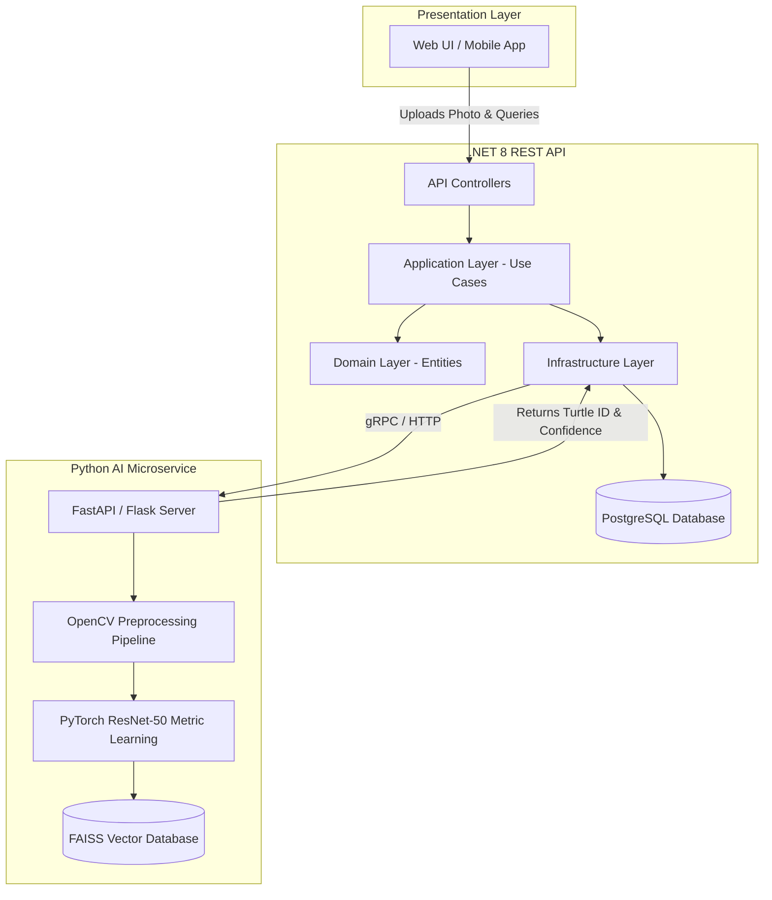

# SeaTurtle Photo-ID: System Architecture

**Last Updated:** 2026-05-03

This document outlines the high-level architecture of the SeaTurtle Photo-ID system, illustrating how the AI, Backend, and Frontend interact.

## 🏗️ High-Level Architecture Diagram

## 🧩 Component Breakdown

### 1. The AI Microservice (Python)
Since the deep learning models and OpenCV pipelines are natively built in Python, they will be hosted in a lightweight Python microservice (e.g., FastAPI).
*   **Input:** Receives an image from the .NET backend.
*   **Processing:** Crops the head (BBox), applies CLAHE, color corrects, and runs the image through the ResNet-50 model to extract a 512-d embedding.
*   **Matching:** Uses a vector search library (like FAISS or a simple KNN search) to find the closest matching embedding in the database.
*   **Output:** Returns the identified Turtle ID (e.g., `Caretta-001`), the bounding box coordinates, and a confidence score (Cosine Distance).

### 2. The Backend (.NET 8)
Built using Clean Architecture principles.
*   **Role:** Handles user authentication, saves raw images to Blob Storage (e.g., AWS S3 or Local), stores turtle metadata (age, location found, species) in PostgreSQL, and orchestrates requests to the AI microservice.

### 3. The Frontend
*   **Role:** A responsive, visually stunning web application for researchers to upload photos, view potential matches (Top-5 candidates), and confirm identities.
