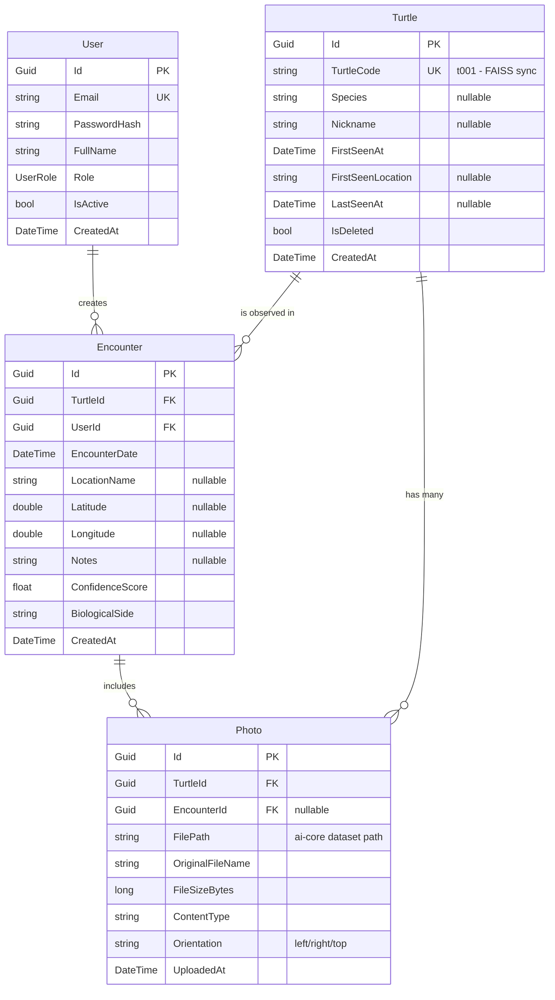
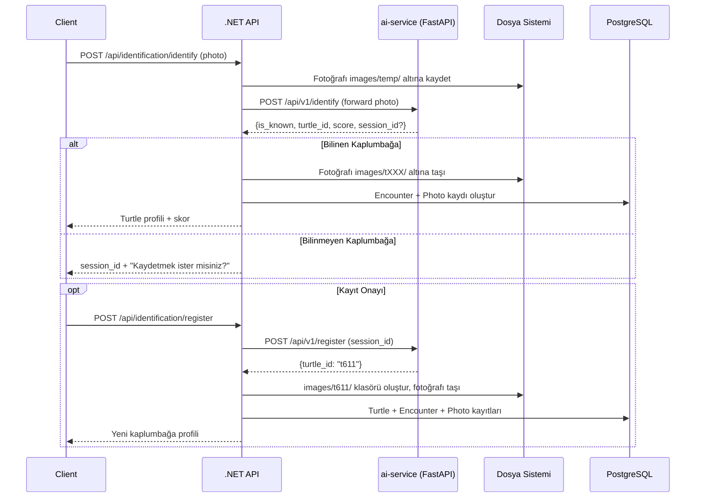

# Phase 3: .NET Backend REST API — Revize Plan

## 1. Kritik Bulgu: Fotoğraf Saklama Sorunu

> [!CAUTION]
> **ai-service şu an fotoğrafları kalıcı olarak SAKLAMIYOR!**
> - `POST /identify`: Fotoğrafı `tempfile` ile geçici diske yazar, inference sonrası **siler** (`Path(tmp_path).unlink`)
> - `POST /register`: FAISS metadata'ya `image_path: "registered_via_api"` yazar — **gerçek dosya yolu yok**
> - Mevcut veri seti yapısı: `ai-core/archiveu/turtles-data/data/images/tXXX/*.JPG` (her kaplumbağanın kendi klasörü)

### Çözüm: .NET Backend Fotoğraf Yönetimini Üstlenir

```
Yeni fotoğraf geldiğinde:
1. .NET → fotoğrafı ai-core/archiveu/turtles-data/data/images/tXXX/ altına kaydeder
2. .NET → fotoğrafı ai-service'e forward eder (identify)
3. ai-service → sadece inference yapar, dosya yönetimine karışmaz
4. Register durumunda → .NET FAISS'e gerçek image_path ile kaydeder
```

Bu sayede **tüm fotoğraflar tek bir yerde** (dataset klasörü) tutulur ve FAISS metadata'daki `image_path` her zaman geçerli olur.

---

## 2. Mevcut Veri Analizi

| Bilgi | Değer |
|-------|-------|
| Toplam unique kaplumbağa | **438** |
| Max turtle ID | **t610** |
| Toplam FAISS vektörü | **8,526** (left: 3,906 / right: 3,634 / top: 986) |
| Fotoğraf yapısı | `images/tXXX/*.JPG` — her kaplumbağanın kendi klasörü |
| Her kaplumbağa birden fazla fotoğraf | Evet (örn. t243: 71, t217: 65 fotoğraf) |
| FAISS metadata alanları | `turtle_id`, `image_path`, `orientation`, `biological_side` |

> [!IMPORTANT]
> **TotalEncounters düzeltmesi:** Bir kaplumbağanın FAISS'te birden fazla vektörü var (farklı fotoğraflar, farklı açılar). Bu 1:N ilişkidir — her fotoğraf ayrı bir kayıttır.

---

## 3. Basit API Mimarisi (.NET 8)

Onion/Clean Architecture **kullanılmayacak**. Basit, katmanlı bir yapı:

```
backend/
├── SeaTurtle.API/
│   ├── Controllers/
│   │   ├── AuthController.cs
│   │   ├── IdentificationController.cs
│   │   ├── TurtlesController.cs
│   │   ├── EncountersController.cs
│   │   └── DashboardController.cs
│   ├── Services/
│   │   ├── IIdentificationService.cs + IdentificationService.cs
│   │   ├── ITurtleService.cs + TurtleService.cs
│   │   ├── IEncounterService.cs + EncounterService.cs
│   │   ├── IAuthService.cs + AuthService.cs
│   │   ├── IAiServiceClient.cs + AiServiceClient.cs
│   │   └── IPhotoStorageService.cs + PhotoStorageService.cs
│   ├── Models/
│   │   ├── Entities/          (User, Turtle, Encounter, Photo)
│   │   ├── DTOs/              (Request/Response modelleri)
│   │   └── Enums/             (UserRole, Species)
│   ├── Data/
│   │   ├── AppDbContext.cs
│   │   └── Configurations/    (EF Core Fluent API)
│   ├── Middleware/
│   │   └── ExceptionHandlingMiddleware.cs
│   ├── Program.cs
│   ├── appsettings.json
│   └── Dockerfile
├── docker-compose.yml         (PostgreSQL + ai-service + backend)
└── SeaTurtle.API.sln
```

---

## 4. Domain Entity'leri

### Entity Relationship



> [!NOTE]
> - **1 Turtle : N Photo** — Bir kaplumbağanın farklı açılardan çekilmiş birçok fotoğrafı olabilir (veri setindeki mevcut yapı)
> - **1 Encounter : N Photo** — Bir gözlemde birden fazla fotoğraf çekilebilir
> - **Photo.FilePath** → `ai-core/archiveu/turtles-data/data/images/tXXX/dosya.jpg` formatında — FAISS metadata ile tutarlı

---

## 5. API Endpoint'leri

### Auth
| Method | Endpoint | Açıklama |
|--------|----------|----------|
| `POST` | `/api/auth/login` | JWT token al |
| `POST` | `/api/auth/register` | Yeni araştırmacı kaydı |
| `GET` | `/api/auth/me` | Oturumdaki kullanıcı |

### Identification (Ana Akış)
| Method | Endpoint | Açıklama |
|--------|----------|----------|
| `POST` | `/api/identification/identify` | Fotoğraf yükle → ai-service'e gönder → sonuç al |
| `POST` | `/api/identification/register` | Bilinmeyen kaplumbağayı kaydet (FAISS + DB + dosya) |

### Turtles
| Method | Endpoint | Açıklama |
|--------|----------|----------|
| `GET` | `/api/turtles` | Liste (paginated, filterable) |
| `GET` | `/api/turtles/{id}` | Detay + encounter geçmişi |
| `PUT` | `/api/turtles/{id}` | Güncelle (nickname, species) |
| `DELETE` | `/api/turtles/{id}` | Soft delete (Admin) |
| `GET` | `/api/turtles/{id}/photos` | Fotoğraf galerisi |

### Encounters
| Method | Endpoint | Açıklama |
|--------|----------|----------|
| `GET` | `/api/encounters` | Liste (paginated, date/location/user filter) |
| `GET` | `/api/encounters/{id}` | Detay |
| `PUT` | `/api/encounters/{id}` | Not güncelle |

### Dashboard
| Method | Endpoint | Açıklama |
|--------|----------|----------|
| `GET` | `/api/dashboard/stats` | Toplam turtle/encounter/user sayıları |
| `GET` | `/api/dashboard/recent` | Son gözlemler |

---

## 6. Tanımlama Akışı (Detaylı)



---

## 7. Docker Compose Yapısı

```yaml
# docker-compose.yml
services:
  postgres:
    image: postgres:16-alpine
    environment:
      POSTGRES_DB: seaturtledb
      POSTGRES_USER: turtle_admin
      POSTGRES_PASSWORD: ${DB_PASSWORD}
    ports:
      - "5432:5432"
    volumes:
      - pgdata:/var/lib/postgresql/data

  # İleride eklenecek:
  # ai-service:
  #   build: ./ai-service
  #   ports:
  #     - "8000:8000"

  # backend:
  #   build: ./backend
  #   ports:
  #     - "5000:5000"

volumes:
  pgdata:
```

---

## 8. DB Seed Stratejisi

FAISS metadata'dan 438 kaplumbağa → PostgreSQL `Turtles` tablosuna seed:

```
1. meta_left.json + meta_right.json + meta_top.json okunur
2. Unique turtle_id'ler çıkarılır (438 adet)
3. Her turtle_id için:
   - Turtle kaydı oluşturulur (TurtleCode = "t001", FirstSeenAt = şimdi)
   - İlişkili fotoğraflar Photo tablosuna eklenir (image_path mevcut)
4. EF Core Migration + Seed Data olarak çalıştırılır
```

---

## 9. Open Questions

> [!IMPORTANT]
> ### ai-service Fotoğraf Akışı Güncellenmeli mi?
> Mevcut ai-service `register` endpoint'i fotoğrafı saklamıyor, sadece embedding'i FAISS'e ekliyor. İki seçenek:
> - **A)** .NET backend fotoğraf yönetimini tamamen üstlenir, ai-service'e dokunulmaz
> - **B)** ai-service güncellenir: register sırasında fotoğrafı `images/tXXX/` altına kaydeder
>
> **Önerim: A** — .NET backend fotoğrafı önce kaydeder, sonra ai-service'i çağırır.

> [!NOTE]
> ### Fotoğraf Servisi
> Kaplumbağa profil sayfasında görseller gösterilecekse, .NET'in bu dosyaları serve etmesi gerekir. `StaticFiles` middleware ile `ai-core/archiveu/.../images/` dizini expose edilebilir.

---

## 10. İmplementasyon Sırası

| # | Adım | Detay |
|---|------|-------|
| 1 | Docker Compose + PostgreSQL | DB ayağa kalk |
| 2 | .NET Solution scaffold | Basit proje yapısı |
| 3 | Entities + DbContext + Migration | EF Core |
| 4 | Auth (JWT) | Login/Register/Me |
| 5 | AiServiceClient | HttpClient → FastAPI |
| 6 | PhotoStorageService | Dosya yönetimi (ai-core dataset ile tutarlı) |
| 7 | IdentificationService + Controller | Ana iş akışı |
| 8 | Turtle + Encounter CRUD | Servisler + Controller'lar |
| 9 | Dashboard | İstatistik endpoint'leri |
| 10 | DB Seed | FAISS metadata → PostgreSQL |
| 11 | Test | xUnit testleri |

---

## 11. Verification Plan

- Swagger UI ile endpoint testleri
- xUnit + WebApplicationFactory ile integration test
- ai-service mock'lanarak izole test
- Docker Compose ile full-stack smoke test
