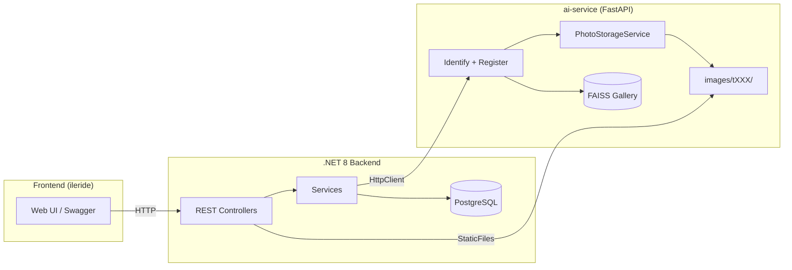
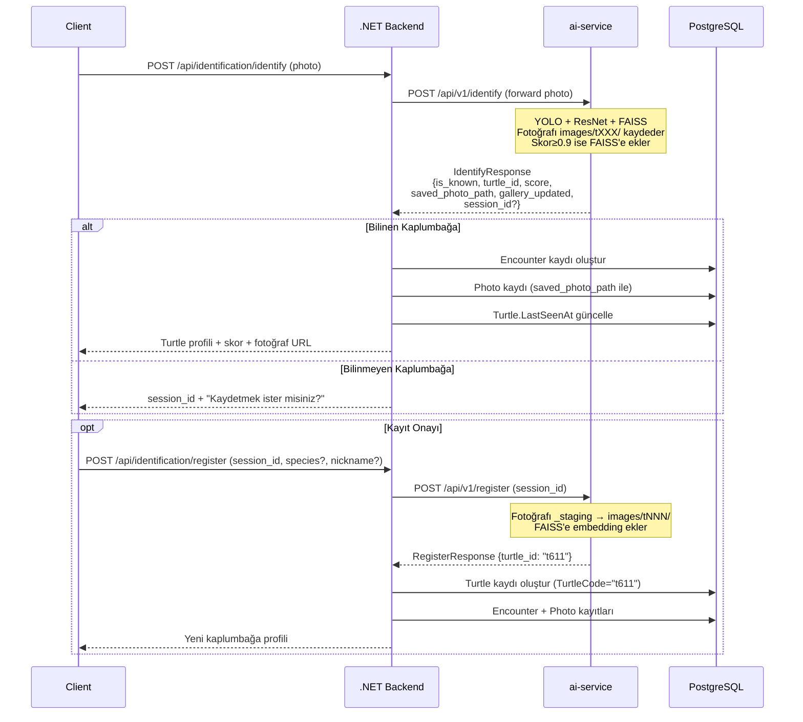

# Phase 3: .NET Backend REST API — İmplementasyon Planı

**Son Güncelleme:** 2026-05-05
**Durum:** Onay bekliyor

---

## 1. Güncel Mimari Durum

### ✅ Çözülen Sorunlar

| Sorun | Çözüm | Durum |
|-------|-------|-------|
| Fotoğraflar kalıcı saklanmıyordu | `ai-service/photo_storage.py` — `PhotoStorageService` oluşturuldu | ✅ Tamamlandı |
| Register'da `image_path="registered_via_api"` yazılıyordu | Artık gerçek dosya yolu FAISS metadata'ya yazılıyor | ✅ Tamamlandı |
| Bilinen kaplumbağa fotoğrafları kaybediliyordu | Bilinen → `images/tXXX/` kaydedilir, skor≥0.9 ise FAISS'e de eklenir | ✅ Tamamlandı |

### ai-service Mevcut Endpoint'ler (Hazır)

| Endpoint | Yaptığı İş |
|----------|-----------|
| `POST /api/v1/identify` | Fotoğraf → YOLO + ResNet + FAISS → tanımlama + fotoğraf kaydetme + galeri güncelleme |
| `POST /api/v1/register` | session_id → yeni turtle_id + fotoğrafı `_staging/` → `images/tNNN/` taşıma + FAISS'e ekleme |
| `GET /health` | Servis sağlık kontrolü |

> [!NOTE]
> **Fotoğraf yönetimi artık tamamen ai-service'de.** .NET backend fotoğraf dosyası kaydetmez, sadece ai-service'e forward eder ve dönen sonuçları DB'ye kaydeder. Fotoğrafları serve etmek için `StaticFiles` middleware ile `images/` dizinini expose eder.

---

## 2. Mevcut Veri Analizi

| Bilgi | Değer |
|-------|-------|
| Toplam unique kaplumbağa | **438** |
| Max turtle ID | **t610** |
| Toplam FAISS vektörü | **8,526** (left: 3,906 / right: 3,634 / top: 986) |
| Fotoğraf yapısı | `images/tXXX/*.JPG` — her kaplumbağanın kendi klasörü |
| Her kaplumbağa birden fazla fotoğraf | Evet (örn. t243: 71, t217: 65 fotoğraf) |
| FAISS metadata alanları | `turtle_id`, `image_path`, `orientation`, `biological_side` |

---

## 3. Sistem Mimarisi



**Sorumluluk Dağılımı:**

| Katman | Sorumluluk |
|--------|-----------|
| **.NET Backend** | Auth, kullanıcı yönetimi, DB (Turtle/Encounter/Photo kayıtları), iş kuralları, fotoğraf servis etme |
| **ai-service** | AI inference, fotoğraf kaydetme/taşıma, FAISS vektör yönetimi, galeri güncelleme |
| **PostgreSQL** | Kalıcı veri: kullanıcılar, kaplumbağalar, gözlemler, fotoğraf metadata'ları |

---

## 4. Basit API Mimarisi (.NET 8)

Onion/Clean Architecture **kullanılmayacak**. Basit, katmanlı bir yapı:

```
backend/
├── SeaTurtle.API/
│   ├── Controllers/
│   │   ├── AuthController.cs
│   │   ├── IdentificationController.cs
│   │   ├── TurtlesController.cs
│   │   ├── EncountersController.cs
│   │   └── DashboardController.cs
│   ├── Services/
│   │   ├── IIdentificationService.cs + IdentificationService.cs
│   │   ├── ITurtleService.cs + TurtleService.cs
│   │   ├── IEncounterService.cs + EncounterService.cs
│   │   ├── IAuthService.cs + AuthService.cs
│   │   └── IAiServiceClient.cs + AiServiceClient.cs
│   ├── Models/
│   │   ├── Entities/          (User, Turtle, Encounter, Photo)
│   │   ├── DTOs/              (Request/Response modelleri)
│   │   └── Enums/             (UserRole, Species)
│   ├── Data/
│   │   ├── AppDbContext.cs
│   │   └── Configurations/    (EF Core Fluent API)
│   ├── Middleware/
│   │   └── ExceptionHandlingMiddleware.cs
│   ├── Program.cs
│   ├── appsettings.json
│   └── Dockerfile
├── docker-compose.yml         (PostgreSQL + ai-service + backend)
└── SeaTurtle.API.sln
```

> [!NOTE]
> **PhotoStorageService .NET'te YOK** — fotoğraf kaydetme ai-service'in sorumluluğunda. .NET sadece `StaticFiles` ile dosyaları serve eder.

---

## 5. Domain Entity'leri

### Entity Relationship


> [!NOTE]
> - **1 Turtle : N Photo** — Bir kaplumbağanın farklı açılardan çekilmiş birçok fotoğrafı olabilir
> - **1 Encounter : N Photo** — Bir gözlemde birden fazla fotoğraf çekilebilir
> - **Encounter.GalleryUpdated** — ai-service'in FAISS'e otomatik ekleme yapıp yapmadığını kaydeder
> - **Photo.FilePath** → ai-service'in döndürdüğü `saved_photo_path` değeri (FAISS metadata ile tutarlı)

---

## 6. API Endpoint'leri

### Auth
| Method | Endpoint | Açıklama |
|--------|----------|----------|
| `POST` | `/api/auth/login` | JWT token al |
| `POST` | `/api/auth/register` | Yeni araştırmacı kaydı |
| `GET` | `/api/auth/me` | Oturumdaki kullanıcı |

### Identification (Ana Akış)
| Method | Endpoint | Açıklama |
|--------|----------|----------|
| `POST` | `/api/identification/identify` | Fotoğraf yükle → ai-service'e forward → DB kaydı |
| `POST` | `/api/identification/register` | Bilinmeyen kaplumbağayı kaydet (ai-service + DB) |

### Turtles
| Method | Endpoint | Açıklama |
|--------|----------|----------|
| `GET` | `/api/turtles` | Liste (paginated, filterable) |
| `GET` | `/api/turtles/{id}` | Detay + encounter geçmişi |
| `PUT` | `/api/turtles/{id}` | Güncelle (nickname, species) |
| `DELETE` | `/api/turtles/{id}` | Soft delete (Admin) |
| `GET` | `/api/turtles/{id}/photos` | Fotoğraf galerisi |

### Encounters
| Method | Endpoint | Açıklama |
|--------|----------|----------|
| `GET` | `/api/encounters` | Liste (paginated, date/location/user filter) |
| `GET` | `/api/encounters/{id}` | Detay |
| `PUT` | `/api/encounters/{id}` | Not güncelle |

### Dashboard
| Method | Endpoint | Açıklama |
|--------|----------|----------|
| `GET` | `/api/dashboard/stats` | Toplam turtle/encounter/user sayıları |
| `GET` | `/api/dashboard/recent` | Son gözlemler |

---

## 7. Tanımlama Akışı (Güncel)



### `IAiServiceClient` Interface

```csharp
public interface IAiServiceClient
{
    /// <summary>Forward photo to ai-service for identification.</summary>
    Task<AiIdentifyResult> IdentifyAsync(Stream photoStream, string fileName);

    /// <summary>Confirm registration of an unknown turtle.</summary>
    Task<AiRegisterResult> RegisterAsync(string sessionId);

    /// <summary>Check ai-service health.</summary>
    Task<bool> HealthCheckAsync();
}
```

### `AiIdentifyResult` DTO (.NET tarafı)

```csharp
public class AiIdentifyResult
{
    public bool Success { get; set; }
    public bool IsKnown { get; set; }
    public string? TurtleId { get; set; }
    public float BestScore { get; set; }
    public string BiologicalSide { get; set; }
    public string? SessionId { get; set; }        // Bilinmeyen ise
    public string? SavedPhotoPath { get; set; }   // ai-service'in kaydettiği yol
    public bool GalleryUpdated { get; set; }      // FAISS'e eklendi mi?
    public string? Error { get; set; }
}
```

---

## 8. Docker Compose Yapısı

```yaml
# docker-compose.yml (proje kökünde)
services:
  postgres:
    image: postgres:16-alpine
    environment:
      POSTGRES_DB: seaturtledb
      POSTGRES_USER: turtle_admin
      POSTGRES_PASSWORD: ${DB_PASSWORD}
    ports:
      - "5432:5432"
    volumes:
      - pgdata:/var/lib/postgresql/data
    healthcheck:
      test: ["CMD-SHELL", "pg_isready -U turtle_admin -d seaturtledb"]
      interval: 5s
      timeout: 3s
      retries: 5

  # İleride containerize edilecek:
  # ai-service:
  #   build: ./ai-service
  #   ports:
  #     - "8000:8000"
  #   volumes:
  #     - ./ai-core:/app/ai-core    # dataset + model paylaşımı

  # backend:
  #   build: ./backend
  #   ports:
  #     - "5000:5000"
  #   depends_on:
  #     postgres:
  #       condition: service_healthy

volumes:
  pgdata:
```

---

## 9. DB Seed Stratejisi

FAISS metadata'dan 438 kaplumbağa + 8,526 fotoğraf → PostgreSQL'e seed:

```
1. meta_left.json + meta_right.json + meta_top.json okunur
2. Unique turtle_id'ler çıkarılır (438 adet, t001...t610)
3. Her turtle_id için:
   - Turtles tablosuna kayıt (TurtleCode, FirstSeenAt=now)
4. Her FAISS metadata entry için:
   - Photos tablosuna kayıt (FilePath=image_path, BiologicalSide, TurtleId FK)
5. EF Core Migration + Seed Data olarak çalıştırılır
```

> [!NOTE]
> Seed script'i bir kerelik çalışır. Seed verisi için `Encounter` kaydı oluşturulmaz — mevcut veri setindeki fotoğraflar tarihsel olarak girilen araştırmacı bilgisi içermez.

---

## 10. Fotoğraf Serve Etme

```csharp
// Program.cs — StaticFiles middleware
app.UseStaticFiles(new StaticFileOptions
{
    FileProvider = new PhysicalFileProvider(
        Path.Combine(builder.Configuration["AiCore:ImagesDir"])
    ),
    RequestPath = "/photos"
});
```

Bu sayede frontend'den fotoğrafa erişim:
```
GET /photos/t042/20260505_a3f7b2.jpg → dosya döner
```

---

## 11. İmplementasyon Sırası

| # | Adım | Detay | Bağımlılık |
|---|------|-------|------------|
| 1 | Docker Compose + PostgreSQL | DB ayağa kalk | — |
| 2 | .NET Solution scaffold | Basit proje yapısı | — |
| 3 | Entities + Enums | Domain modelleri | — |
| 4 | DbContext + Configurations + Migration | EF Core setup | 3 |
| 5 | Auth (JWT) | Login/Register/Me | 4 |
| 6 | `AiServiceClient` | HttpClient → FastAPI | 4 |
| 7 | `IdentificationService` + Controller | Ana iş akışı | 5, 6 |
| 8 | Turtle + Encounter CRUD | Servisler + Controller'lar | 4 |
| 9 | Dashboard endpoint'leri | İstatistikler | 8 |
| 10 | Fotoğraf serve etme | StaticFiles middleware | 2 |
| 11 | DB Seed | FAISS metadata → PostgreSQL | 4 |
| 12 | Unit + Integration Tests | xUnit testleri | 7, 8 |

---

## 12. Verification Plan

- Swagger UI ile endpoint testleri
- xUnit + `WebApplicationFactory` ile integration test
- ai-service mock'lanarak izole test
- Docker Compose ile full-stack smoke test (PostgreSQL + ai-service + .NET)
